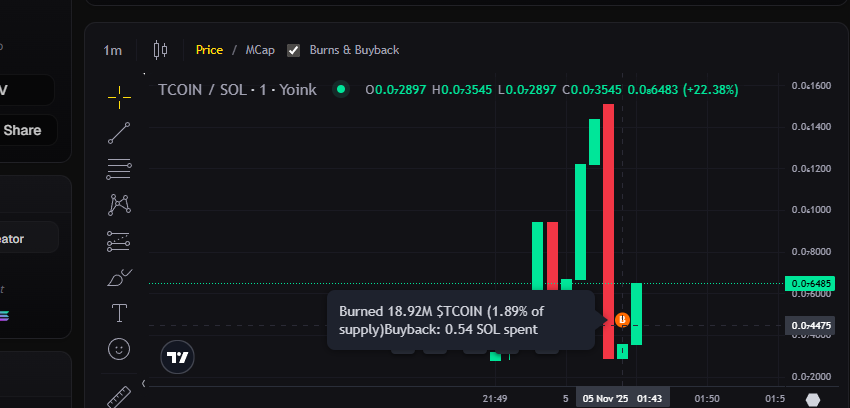
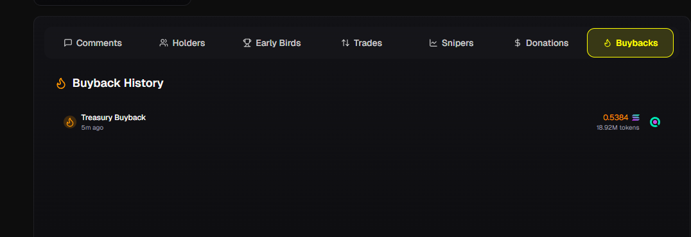

# 🔄 Auto Buyback

Yoink features an **algorithmic buyback mechanism** for all coins created on the platform.  
When market conditions are favorable, the system automatically purchases and burns tokens using the **treasury pool**, helping to stabilize prices and reduce circulating supply.  

This mechanism supports long-term **token health and sustainability**, ensuring a more stable experience for traders.  
**Treasury pools grow over time** through the fees accumulated from trading volume.

## 🎯 How Autobuyback Works

<figure><figcaption></figcaption></figure>

### Simplified Trigger Logic


**🎯 Single Clear Condition:**

Buyback triggers when **current token price drops 10% below the EMA trend line**.

- ✅ **Easy to Predict**: Just watch the EMA line on charts
- ✅ **Fast Response**: 50% EMA alpha responds quickly to recent prices  
- ✅ **Reliable Support**: Automatic buying pressure at predictable level
- ✅ **No Ambiguity**: Single metric makes system transparent


### How the System Works


**📊 Step-by-Step Process:**

1. **EMA Tracking**: System calculates Exponential Moving Average on every trade (50% alpha for fast response)
2. **Price Monitoring**: Compares current price to EMA after each transaction
3. **Trigger Detection**: When price falls to 90% of EMA (10% drop), buyback activates
4. **Budget Allocation**: System allocates 60% of treasury SOL for buyback
5. **Token Calculation**: Converts SOL to token amount via bonding curve math
6. **Supply Cap**: Limits purchase to 40% of on-curve supply per buyback
7. **Internal Transfer**: SOL moves from treasury vault → liquidity vault (internal only)
8. **Burn Execution**: Purchased tokens permanently burned from circulation
9. **Event Logging**: Transaction recorded, visible on Buybacks tab


## ⚙️ Technical Implementation
### Dynamic Parameters

| Parameter | Production Value | Purpose |
|-----------|-----------------|---------|
| **EMA Drop Threshold** | 90% (9,000 bps) | **Primary trigger**: 10% price drop from EMA |
| **EMA Response Speed** | 50% (5,000 bps) | Fast EMA response to recent price changes |
| **Treasury Spend** | 60% (6,000 bps) | Uses 60% of treasury per buyback |
| **Max Supply Per Buyback** | 40% (4,000 bps) | Caps single buyback to 40% of on-curve supply |
| **Max Burn Total** | 25% (2,500 bps) | Lifetime burn limit relative to total supply |

## 📊 Monitoring 

### Buyback Activity Tab

<figure><figcaption></figcaption></figure>


**📈 Track Buybacks on Token Pages:**
- Each coin page includes a dedicated **"Buybacks" tab**
- View complete history of all buyback events
- See exact timing, amounts, and transaction links
- Monitor treasury utilization and burn statistics

**🔗 Transaction Visibility:**
- **Burn transactions** are fully visible on Solana blockchain
- **Buy operations** happen internally within the program
- Only the burn will show as an external transaction
- The buyback "purchase" is actually an internal ledger update


### Internal Mechanics Explained


**🔄 How the "Buyback" Works Internally — and Why There’s No Visible SOL Inflow on Solana Explorer:**
- SOL moves internally from the **treasury vault** to the **bonding curve liquidity pool**  
- The token quotation updates to reflect the increased SOL reserves  
- **No actual SOL leaves the bonding curve** — it’s simply an internal transfer between vaults (treasury → AMM vault)  
- **Result:** Treasury balance decreases, curve liquidity increases, and tokens are burned  

**💡 Why You Only See Burns on Solana Explorer:**
- The “purchase” is recorded as an internal AMM ledger adjustment  
- Only the final **burn transaction** appears on-chain, since SOL never leaves the bonding curve account — it’s just reallocated between internal vaults


**🔥 Autobuyback is enabled by default** for all tokens and operates automatically without any user intervention required.

