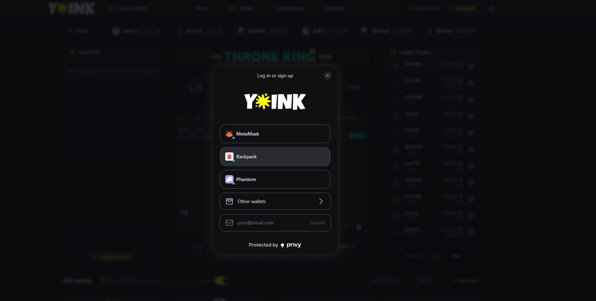
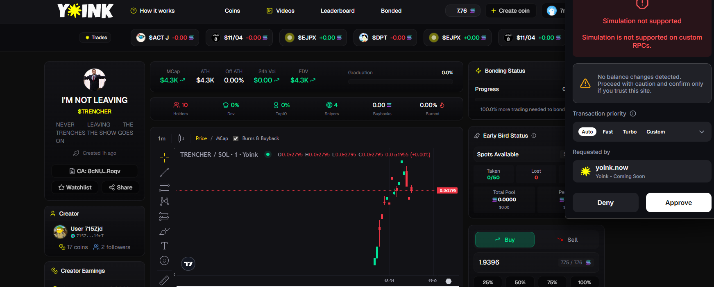
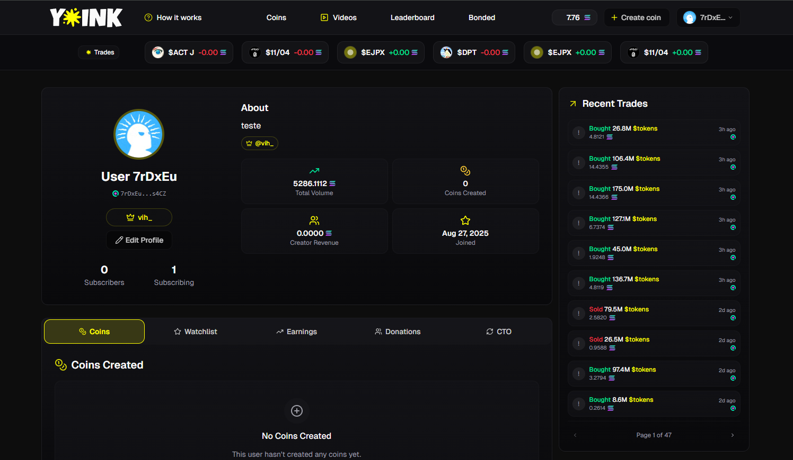

# Quickstart

<figure><figcaption></figcaption></figure>

Welcome to Yoink! This quickstart guide will get you trading creator tokens in minutes.

## What You'll Need

* An email address, phone number, or existing wallet
* Some SOL for trading and transaction fees
* A web browser (desktop recommended for best experience)

### Step 1: Connect Your Wallet

<figure><figcaption></figcaption></figure>

Yoink uses [Privy](https://privy.io) as our secure login method, supporting multiple authentication options:

* **Email** - Sign in with your email address
* **Phone** - Use your phone number with SMS verification
* **Social Logins** - Connect via Google, Twitter, Discord, and more
* **Existing Wallets** - Connect Phantom, Solflare, and other Solana wallets
* **Embedded Wallets** - Get a secure, built-in wallet automatically created for you

**How to connect:**
1. Visit [https://yoink.now](https://yoink.now)
2. Click the **"Connect"** button in the top right
3. Choose your preferred login method
4. Complete the authentication process


**Tip**: If you're new to crypto, we recommend using email or social login - Privy will automatically create a secure embedded wallet for you! Make sure you have at least 0.1 SOL for trading fees and transactions.


### Step 2: Browse Tokens

<figure><figcaption></figcaption></figure>

Once connected, you can browse available creator tokens in several ways:

* **All Coins**: View all available tokens sorted by various metrics
* **Leaderboard**: See top performing tokens and creators
* **Live Streams**: Find tokens for creators currently streaming

### Step 3: Your First Trade

<figure><figcaption></figcaption></figure>

1. Click on a token card to view details
2. Review the chart, market cap, and trading activity
3. Enter the amount of SOL you want to spend
4. Click **"Buy"** and confirm the transaction


**Important**: The first 20 buyers of each token become **Early Birds** and are eligible for bonus rewards! [Learn more about Early Birds →](../traders/early-bird-bonus.md)


### Step 4: Monitor Your Trades

<figure><figcaption></figcaption></figure>

* View your holdings in the **Profile** section
* Track your Early Bird status
* Monitor token performance in real-time
* Check your rewards and earnings

## Next Steps

<table data-view="cards"><thead><tr><th></th><th></th><th data-hidden data-card-target data-type="content-ref"></th></tr></thead><tbody><tr><td><strong>Trading Guide</strong></td><td>Learn advanced trading strategies</td><td><a href="../traders/trading-guide.md">trading-guide.md</a></td></tr><tr><td><strong>Early Bird Bonus</strong></td><td>Understand how to maximize rewards</td><td><a href="../traders/early-bird-bonus.md">early-bird-bonus.md</a></td></tr><tr><td><strong>For Creators</strong></td><td>Are you a creator? Learn how to claim rewards</td><td><a href="../creators/creator-guide.md">creator-guide.md</a></td></tr></tbody></table>
