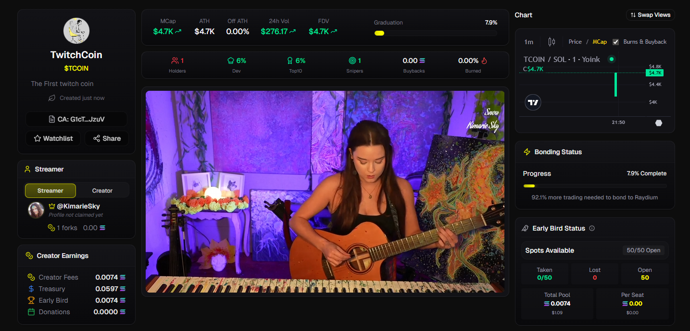
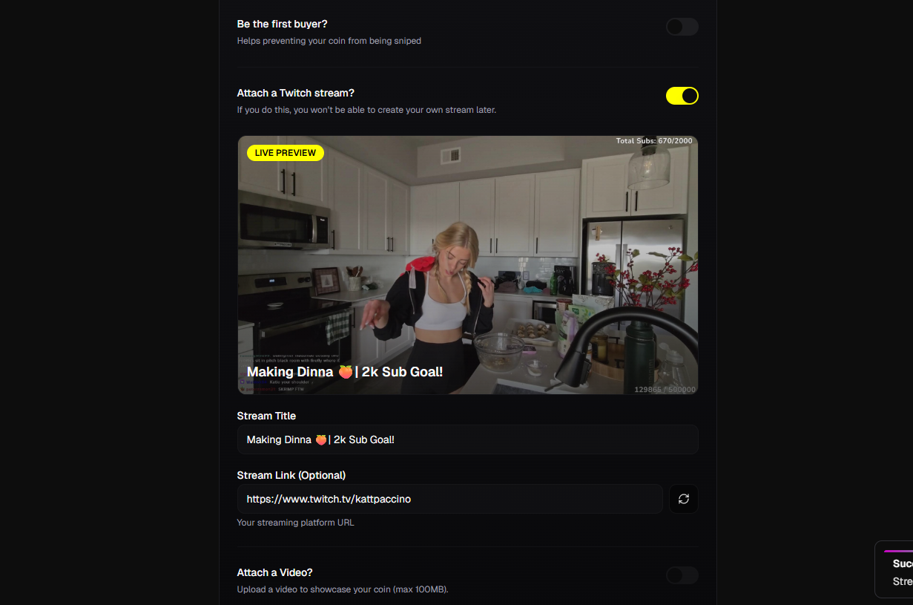
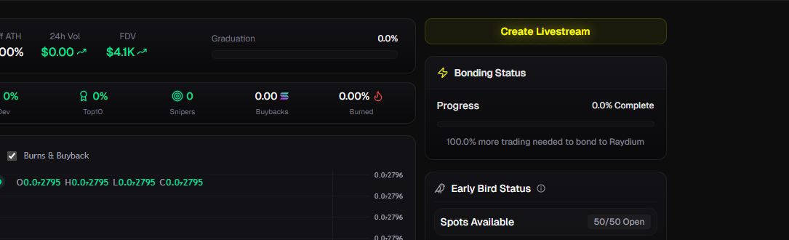

# How to Attach a Stream

<figure><figcaption></figcaption></figure>

Connect your Twitch stream to your token for real-time engagement and live trading activity. Streaming tokens get special visibility and help build stronger communities around your project.

## Two Ways to Stream

### Option 1: Fork Existing Twitch Stream (During Token Creation)

<figure><figcaption></figcaption></figure>

When creating your token, you can connect an existing Twitch stream:

1. **Toggle on "Attach a Twitch stream"** during coin creation
2. **Enter your stream title** - this becomes your token's main title
3. **Add your Twitch URL** (optional) - e.g., `https://twitch.tv/yourusername`
4. **Click the refresh button** to auto-load live stream information
5. **Create your token** - stream integration happens immediately

### Option 2: Start Direct Stream (After Token Creation)

<figure><figcaption></figcaption></figure>

Create your token first, then start streaming directly on Yoink:

1. **Create your token** without attaching a stream
2. **Visit your token page** after creation
3. **Click "Start Stream"** button
4. **Set up your streaming software** with provided stream key or just use in-built broswer support.
5. **Go live** directly on Yoink platform


**Important Choice:** If you attach a Twitch stream during token creation, you **cannot** start a direct Yoink stream later. Choose your streaming method carefully!


## Platform Support

### Currently Available
- **Twitch** - Full integration with live detection and thumbnails

### More platforms coming soon

