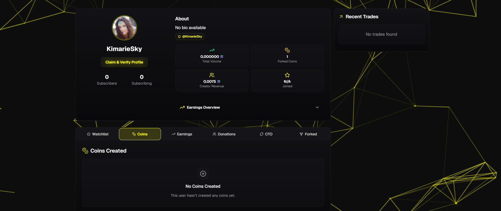

# Streamer Profiles

Discover streamer profiles to learn about streamers, view their trading history, and explore their related tokens.

## 📊 What You'll See

<figure><figcaption></figcaption></figure>

### 👤 Profile Header

**Basic Info**
- Profile picture and username (e.g., "KimarieSky" @KimarieSky)  
- Verification badge (✓) - only for verified streamers
- Follow/Subscribe and Claim Profile buttons


### 📈 Key Stats

| Metric | Description |
|--------|-------------|
| **Subscribers** | Followers of this streamer on Yoink |
| **Total Volume** | All-time trading volume |
| **Creator Revenue** | Earnings from tokens |
| **Forked Coins** | Tokens created by others using this streamer |

### 🔖 Profile Tabs


**🔗 Watchlist** - Tokens they're monitoring  
**🪙 Coins** - Tokens they've created  
**📈 Earnings** - Revenue breakdown  
**🎁 Donations** - Community support received  
**🔄 CTO** - Tokens they own significantly  
**🍴 Forked** - Connected/derivative projects


## 🚨 Verification Process


**Important: The streamer page doesn't necessary means the streamer knows about Yoink.**

**📝 Unverified Profile**
- Created by community members when using the streamer link
- May just represent the streamer with public info
- Real creator might not be on platform

**✅ Verified Profile** 
- Manually checked by Yoink team
- Real streamer confirmed their presence  
- Identity and ownership authenticated
- Wallet address is now public



---