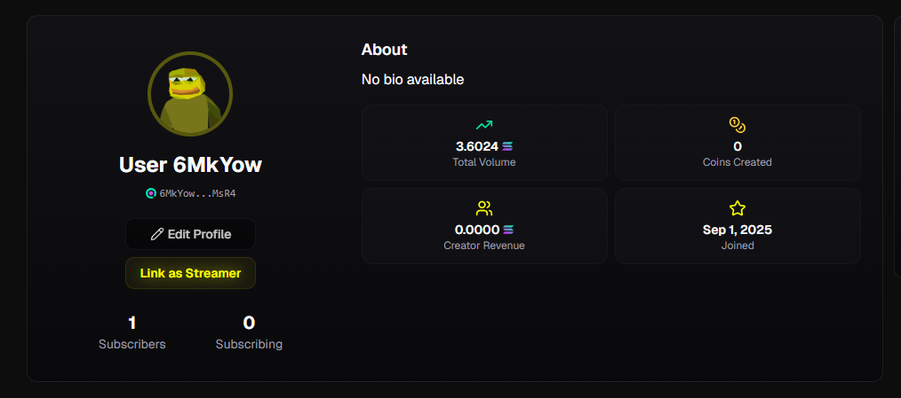
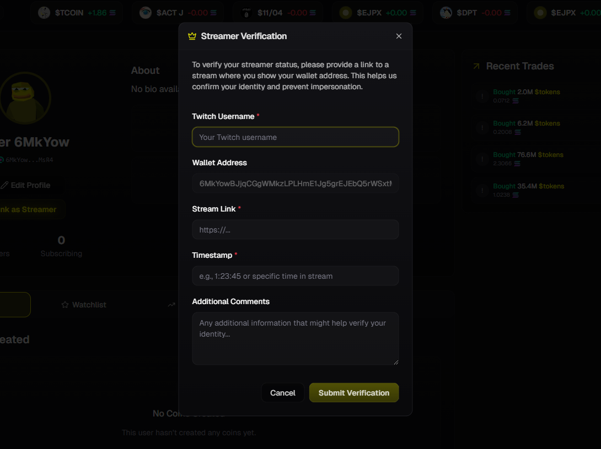

# Streamer Verification

Verify your identity as a streamer to claim your profile, build trust with your community, and unlock enhanced features on Yoink.

<figure><figcaption></figcaption></figure>

## 🎯 How to Start Verification

### From Your Profile
1. **Visit your user profile** on Yoink
2. **Click "Link as Streamer"** button
3. **Fill out the verification form** in the modal

### From Another Streamer's Profile
1. **Visit any streamer profile** you want to claim
2. **Click "Claim & Verify Profile"** button
3. **Complete the verification process**

## 📋 Verification Form

### Required Information

**Twitch Username** *(Required)*
- Enter your exact Twitch username
- Must match your actual Twitch channel
- Case-sensitive

**Wallet Address** *(Auto-filled)*
- Your connected wallet address appears automatically
- This links your on-chain identity to your stream

**Stream Link** *(Required)*
- Full URL to your Twitch stream
- Format: `https://twitch.tv/yourusername`
- Must be a live, accessible stream

**Timestamp** *(Required)*
- Specific time during your stream for verification
- Format: `1:23:45` or description like "at 30 minutes"
- When you'll show proof of ownership

**Additional Comments** *(Optional)*
- Any extra information to help verify your identity
- Special instructions or context
- Backup verification methods

## 🔍 Verification Process

<figure><figcaption></figcaption></figure>

### Step 1: Submit Request

**What happens:**
- Fill out the verification form completely
- Click "Submit Verification"
- Your request enters the review queue
- Yoink team receives your submission


### Step 2: Provide Stream Proof

**Required during your stream:**
- **Show your wallet address** on screen and let us know the timestamp
- **Display both** wallet address 
- **Keep proof visible** for at least 10 seconds

**Example proof:**
"Hi, I'm verifying my Yoink profile. My wallet address is GMkYowBJaCCgWMkzLPUImEJqG5qEJEbQGRWSxH and you can check it at 'streamlink' on time XX:XX:XX"


### Step 3: Yoink Team Review

**Manual verification includes:**
- ✅ Checking your stream at the specified timestamp
- ✅ Confirming wallet address matches your submission
- ✅ Verifying audio/visual proof is clear
- ✅ Cross-referencing with Twitch account details
- ✅ Ensuring no impersonation attempts

**Review time:** Usually 24-48 hours


## ✅ After Verification

### Verified Benefits
- **Verification badge** ✓ on your profile
- **Instant fee claims** - All stream-related fees become claimable immediately, including past earnings

### Profile Updates
- Your profile becomes officially verified
- Verification badge appears next to your name
- Enhanced earnings transparency unlocked
- Full trading history becomes visible
- **All historical stream fees** are instantly available for withdrawal

